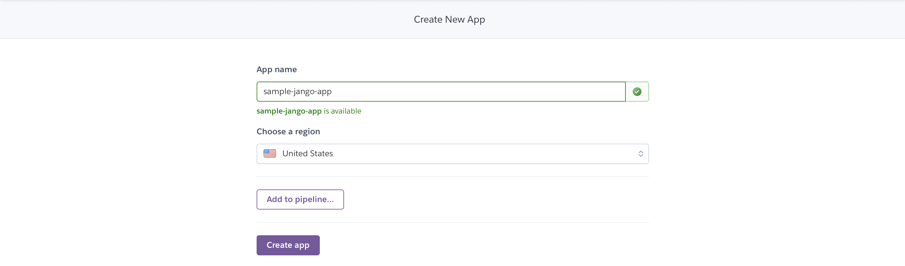
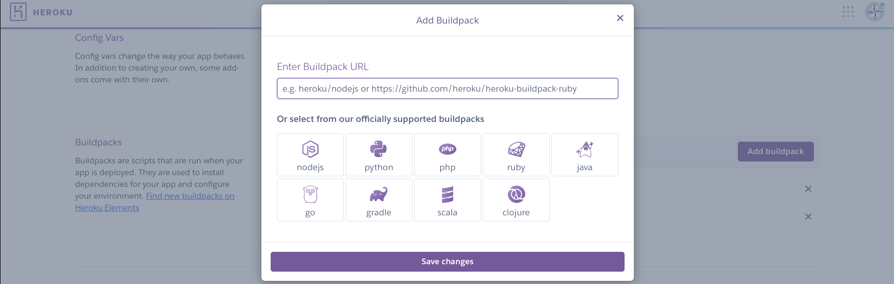
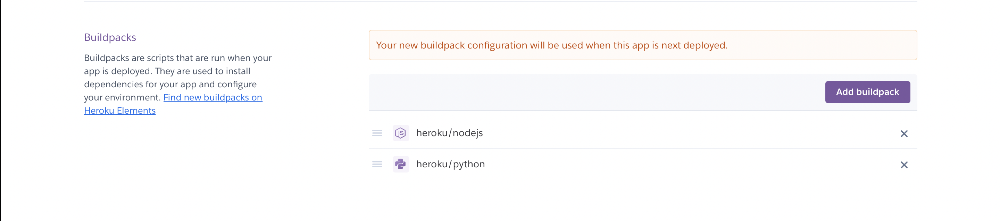
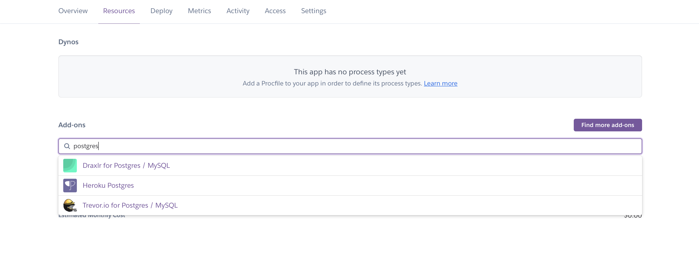
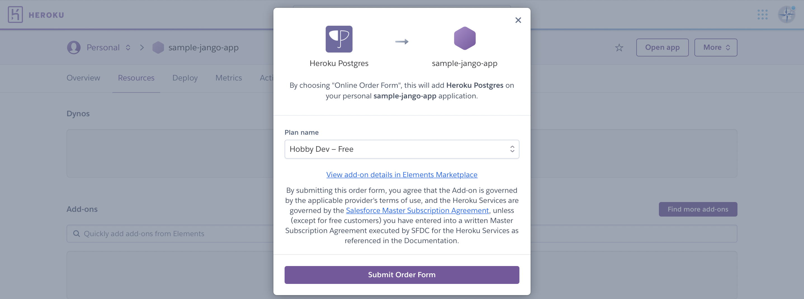
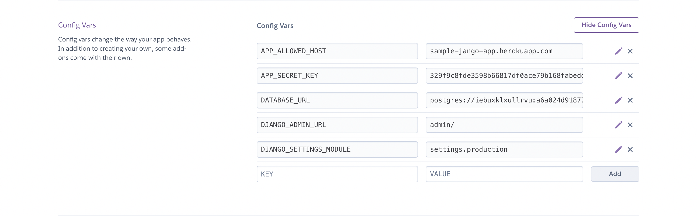
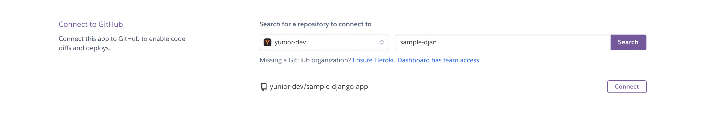
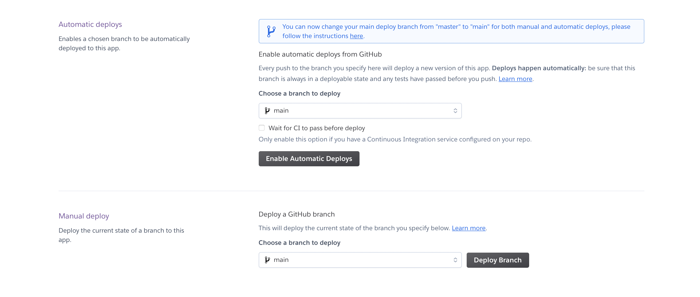
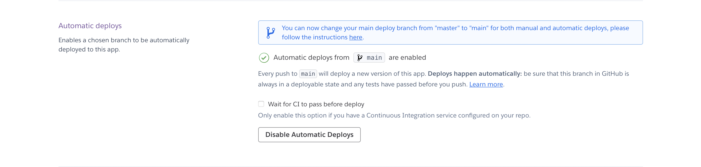

---

Powered by [Cookiecutter](https://github.com/cookiecutter/cookiecutter), Django-Cookie is a template for jumpstarting Django projects quickly.

My version is inspire by Daniel Roy Greenfeld's [cookiecutter-django](https://github.com/pydanny/cookiecutter-django). This cookiecutter is opinionated and barebone and contains less features.

---

## Features

- [Django](https://docs.djangoproject.com/en/3.2/) version 3.2
- Works with Python versions 3.9, 3.8, 3.7, 3.6
- Uses PostgreSQL or SQLite3
- Uses [Pipenv](https://pipenv.pypa.io/en/latest/) to manage virtual enviroments.
- Support for [async](https://docs.djangoproject.com/en/3.2/topics/async/) as of Django 3.0 ([asgi.py](https://docs.djangoproject.com/en/3.2/howto/deployment/asgi/))
- Custom static files pre-processing with [Laravel-Mix](https://github.com/JeffreyWay/laravel-mix) and [Django Mix](https://pypi.org/project/djangomix/)
- I'm using [Tailwindcss](https://tailwindcss.com/docs) as the default frontend style, this can be change to any frontend stylesheet.
- Support for [Vue.js](https://vuejs.org) as the frontend client.

---

#### _Note: Django 3.2 Improperly configure cannot import 'App_Name'._

This error is due to the new way Django 3.2 handles AppConfig, and it only happens when using the apps module to store your applications.

`AppConfig.name` should be the full path to the application. Example: since `users` is inside the `apps` module, in the AppConfig class in side apps.py you should use `'apps.users'` instead of `'users'`.

```
class UsersConfig(AppConfig):
    name = 'apps.users'
```

---

## Usage

First make sure you have [Cookiecutter](https://cookiecutter.readthedocs.io/en/1.7.2/installation.html#install-cookiecutter), [Pipenv](https://pipenv.pypa.io/en/latest/), and [Node.js](https://nodejs.org/en/) installed:

Create you project by running the following command:

```
cookiecutter https://github.com/yunior-dev/django-cookie
```

```
cd project-name
```

```
pipenv shell
```

```
pipenv install
```

Run this command to install dev packages

```
pipenv install -d
```

Run the dev server with the following pipenv script

```
python manage.py runserver
```

To used tailwindcss in the client, you must install the dependencies in `package.json` and run the `start` or `watch` script

```
npm install
```

```
npm run start
```

Similarly if Vue.js is used as the client, you must install the dependencies in `package.json` and run the `start` or `watch` script

```
npm install
```

```
npm run start
```

---

## Commands

When pipenv is active you can run all the standard `python manage.py`, additionally I added two custom helper commands.

- showurls - Prints a list of every url path in the project.

```
python manage.py showurls
```

- genkey - Generates a 32 bit key.

```
python manage.py genkey
```

In addition the Pipfile has several command scripts that are optional to use. These act like aliases, to use simply run `pipenv run command`.

List of command available:

```
collectstatic = "python manage.py collectstatic"
createsuperuser = "python manage.py createsuperuser"
genkey = "python manage.py genkey"
makemigrations = "python manage.py makemigrations"
migrate = "python manage.py migrate"
server = "python manage.py runserver"
showurls = "python manage.py showurls"
startapp = "python manage.py startapp"
test = "python manage.py test"
```

---

## Development Packages

This cookicutter comes with a preset of development packages.

- [Flake8](https://github.com/PyCQA/flake8) is a linter for Python code style guide enforcement. See the [config](https://flake8.pycqa.org/en/latest/internal/option_handling.html?highlight=config#flake8.options.config.ConfigFileFinder.user_config) file to add or change style guide. To use run `flake8` command from the terminal.
- [Flake8 Isort](https://github.com/gforcada/flake8-isort) checks if the imports on your python files are sorted the way you expect. To use run `isort .` command from the terminal, or run `isort . && flake8` to run both sorting and linting.
- [Django Debug Toolbar](https://github.com/jazzband/django-debug-toolbar) displays various debug information about the current request/response.
- [Yapf](https://github.com/google/yapf) for code formating. It takes the code and reformats it to the best formatting that conforms to the style guide. Remember to change the setting in your IDE to use yapf.

---

## Project Generation Options

##### project_name:

Your project's human-readable name, capitals and spaces allowed.

##### project_slug:

Your project's slug without dashes or spaces. Used to name your repo and in other places where a Python-importable version of your project name is needed.

##### description:

Describes your project and gets used in places like `README.rst` and such.

##### author_name:

This is you!

##### domain_name:

The domain name you plan to use for your project once it goes live. Note that it can be safely changed later on whenever you need to.

##### database:

Select a database to use, choises are PostgreSQL and SQLite3:

##### use_async:

Indicates whether the project should use web sockets with Uvicorn + Gunicorn.

##### use_vuejs:

Indicates whether the project should use Vue.js as the frontend client.

##### use_whitenoise:

Indicates whether the project should be configured to use WhiteNoise\*.

##### use_heroku:

Indicates whether the project should be configured so as to be deployable to Heroku\*.

##### read_dot_env_file:

Indicates whether the project to use a local .env file.

##### debug:

Indicates whether the project should be configured for debugging.

---

## Heroku Deployment

I like to use Heroku as a deployment platform, although it is not the cheapest option for scaling. Deploying a Django app to Heroku is usually relatively easy. However, because we use node.js in the project, we must follow some additional steps to build our javascript and CSS for production properly.

### Pre-Deployment

First, and most importantly, Heroku web applications require a `Procfile`. If you selected "y" to `use_heroku` option, then this file was provided with the necessary processes already included.

`./Procfile`

```
release: python manage.py migrate
release: python manage.py collectstatic --noinput
web: gunicorn config.wsgi:application
```

The `release:` preocess runs any command you whant after the Build process is finished compiling. In this case we are going to run the migrations and collectstatic commands.

Heroku will use `Pipfile` and `Pipfile.lock` to download necessary packages. Additionally we are providing a `runtime.txt` with the version of Python used.

Have the proper settings file for production. I have provided `settings/production.py` file with basic outbox configurations. However, you should always check to see if the settings suit your project and add any other settings you may need.

Finally, commit your project to GitHub, as we will be using it to deploy and automate.

### Deployment

I like you use the Heroku web app for deployment and have the terminal running the logs. In this explanation, I will focus on the web app deployment but will provide the terminal commands for each step.

#### Step 1

First, login to the [Heroku website](https://id.heroku.com/login) or sign up if you haven't done so already. For those using the terminal, you will need to download the [Heroku CLI](https://devcenter.heroku.com/articles/heroku-cli) if you haven't done so already. To log in simply run:

```
heroku login
```

Next we need to create an application, this is simple just click the `New` then `Create new app` from the dashboard.




In the terminal run:

```
heroku create APP-NAME
```

#### Step 2

We are going to add the buildpacks for the project. This step is essential because we will need two buildpacks, one for **Django** and the other to build our resources with **Laravel-Mix**. We also want to ensure that the `node.js` buildpack runs before the `python` buildpack to ensure the static assets are ready when we run collectstatic.

In your app, navigate to the **Settings** tab, here you will find the **Buildpacks** section. Click `Add buildpack`, select the `node.js` buildpack first, then save, repeat and add the `python` buildpack and then save.



You should see the following under Buildpacks.



To add the buildpacks from the terminal simply run the following commands:

```
heroku buildpacks:add heroku/nodejs
```

```
heroku buildpacks:add heroku/python
```

After adding the second buildpack to should get the following output:

```
$ Buildpack added. Next release on APP-NAME will use:
  1. heroku/nodejs
  2. heroku/python
```

#### Step 3

Configure a PostgreSQL database for the application if needed. To do so, navigate to the **Resources** tab and in the search field under Add-ons search for **Postgres** and select the **Heroku Postgres** option. You will see a Plan option menu. For this example, I'm choosing the **Hobby Dev** option, which is free to use, but ideally, for real-world applications, you should choose a paid option that suits your application.




For terminal users, simply run the following command:

```
heroku addons:create heroku-postgresql:<PLAN_NAME>
```

Remenber to add the plan name you want to use for example `hobby-dev`.

#### Step 4

We are now going to add the necessary enviroment variables the app needs to run. To add the variables, under the **Settings** tab find the [Config Vars](https://devcenter.heroku.com/articles/config-vars) section and click the `Reveal Config Vars` button.


Add the following variables:

_Note Heroku will add the DATABASE_URL when you provisioned it in step 3. Add the DISABLE_COLLECTSTATIC and DJANGO_SETTINGS_MODULE as shown below, but the rest should be change to your specifications specially the secret key, there is a genkey command you can use by running the `python manage.py genkey`._

```
APP_ALLOWED_HOST          = example.com,example.heroku.com
APP_SECRET_KEY            = !!YOUR_SECRET_KEY!!
DATABASE_URL              = postgres:database
DJANGO_ADMIN_URL          = your/admin/url/
DJANGO_SETTINGS_MODULE    = settings.production
```



To add confi variables in the terminal, run `heroku config:set DJANGO_SETTINGS_MODULE=settings.production` for every variable except DATABASE_URL.

#### Step 5

To deploy the application:

1. Make sure all your changes are committed and published to GitHub.

2. In Heroku, make your way to the **Deploy** tab.

3. Find the section label **Deployment method** and click on the `GitHub` tab.


4. For the next part, make sure Heroku is connected to your GitHub account [click here](https://devcenter.heroku.com/articles/github-integration#enabling-github-integration) for instruction.

5. In the **Connect to GitHub** section, use the search field to search for your project name in GitHub. Once located, click on the `Connect` button next to the project name.



When connected, you will see two new sections label **Automatic deploys** and **Manual deploy**. We will use Manual deployment for the first deployment and the set up Automatic deploys for future implementations.



I like to run the Heroku log command in the terminal to see any errors that may occur during the deployment process. Run the following command:

```
heroku logs --tail -a APP-NAME
```

In the **Manual deploy** section, select the GitHub branch you want to deploy and click `Deploy Branch`, and watch all your hard work 🤞 go live.

For terminal users run the command:

```
git push heroku main
```

#### Step 6

To automate future updates to your app, go to the **Automatic deploys** section and click `Enable Automatic Deploys`, and that's it. Next time you push your project to GitHub, Heroku will automatically run a deployment.

_You can always disable this function._



#### Step 7

If using the django admin site, you will need to create a super user. To do so, run the following command in the terminal:

```
heroku run python manage.py createsuperuser -a APP-NAME
```

_Note the **-a** follow by the Heroku **APP-NAME**. This is useful because it allows you to run any command without getting the application remote repository from Heroku._

##### Other useful Heroku Commands

Allows the user to connect to the Heroku application bash terminal. To Exit run the `exit` commnad.

```
heroku run bash -a APP-NAME
```

Allows the user to see a log of the application.

```
heroku logs --tail -a APP-NAME
```

---

## Project Directories

A layout of directories. _Note that depending on the options selected, you will not see every directory and file below._

When a new django app is created, you must drag it manually into the **apps** directory.

```
project/
|---- apps
|   |---- client
|   |   |---- apps.py
|   |   |---- urls.py
|   |   |---- views.py
|   |---- core
|   |   |---- management
|   |   |   |---- commands
|   |   |   |   |---- genkey.py
|   |   |   |   |---- showurls.py
|   |   |---- migrations
|   |   |---- apps.py
|   |   |---- models.py
|   |---- users
|   |   |---- apps.py
|   |   |---- urls.py
|   |   |---- views.py
|---- config
|   |---- asgi.py
|   |---- urls.py
|   |---- wsgi.py
|---- media
|---- resources
|   |---- css
|   |   |---- app.css
|   |---- js
|   |   |---- app.js
|---- settings
|   |---- base.py
|   |---- development.py
|   |---- production.py
|---- static
|   |---- mix-manifest.json
|   |---- assets
|   |   |---- favicon
|   |   |   |---- favicon.png
|---- templates
|   |---- welcome.html
|   |---- layouts
|   |   |---- app.html
|---- urls
|   |---- api.py
|   |---- web.py
|---- .editorconfig
|---- .env
|---- .env.sample
|---- .flake8
|---- .gitignore
|---- .isort.cfg
|---- .prettierrc
|---- manage.py
|---- package.json
|---- Pipfile
|---- Procfile
|---- README.md
|---- runtime.txt
|---- tailwind.config.js
|---- webpack.mix.js
```
